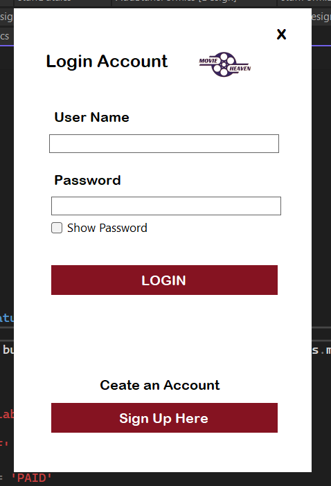
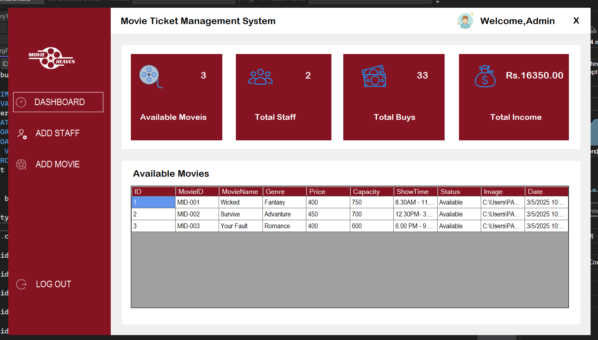
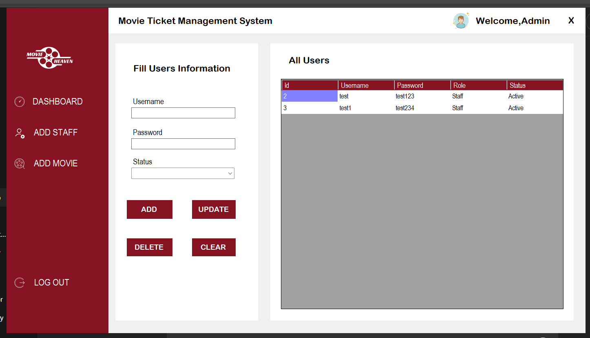
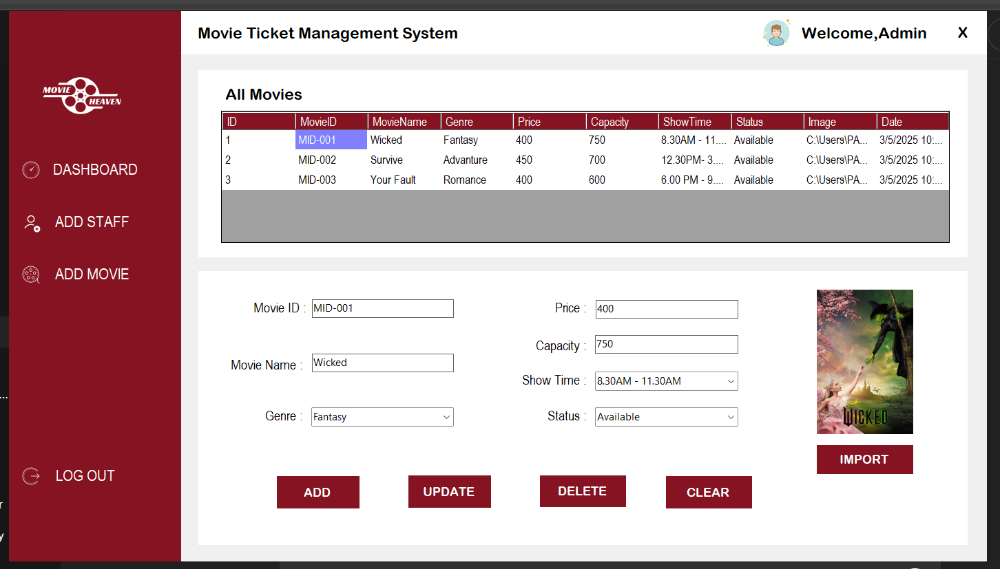
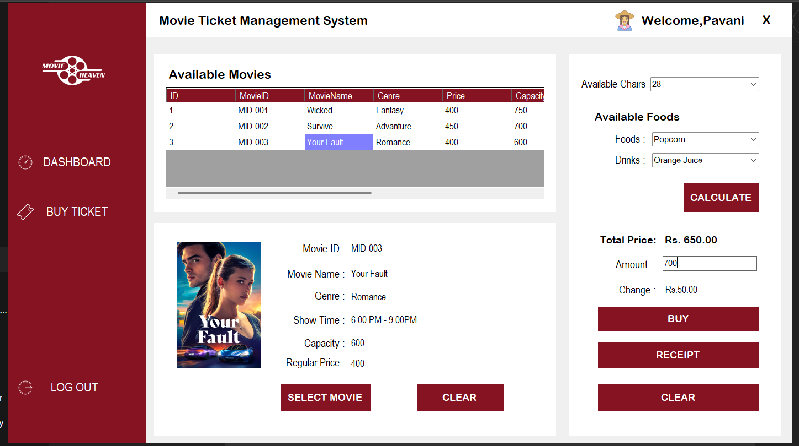
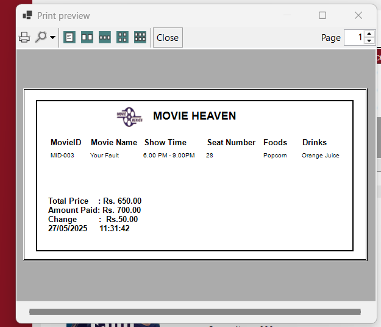

# 💻 MovieHeaven – Desktop Application

This is the **desktop interface** of the MovieHeaven Movie Ticket Management System. Built with **C# and WPF**, it is primarily designed for **theater staff**, including **admins** and **cashiers**, to manage daily operations such as movie schedules, seat bookings, ticket issuing, and staff records.

---

## 🧩 Features

### 🔐 Authentication
- **Admin Login** – Secure login for administrators.
- **Cashier Registration & Login** – Cashiers can register and log in to manage ticketing.

### 🧑‍💼 Admin Panel
- **Staff Management (CRUD)** – Admins can create, read, update, and delete cashier/staff accounts.
- **Movie Management (CRUD)** – Admins can add, edit, view, and delete movie details and schedules.

### 🎟️ Cashier Panel
- **Seat Booking** – Cashiers can view showtimes, select available seats, and book them for customers.
- **Ticket Issuing** – Automatically generate and issue tickets after successful bookings.

---

## 🛠 Tech Stack

- **Language**: C#
- **UI Framework**: WPF (.NET Core / .NET Framework)
- **Database**: MYSQL
- **IDE**: Visual Studio 2022

---

## ▶️ Run the Application

 1. Clone the repository
git clone https://github.com/pavani-edirisinghe/MovieHeaven.git

2. Navigate to the Desktop Application directory
cd MovieHeaven/"Desktop Application"

3. (Optional) Restore dependencies (if using .NET Core)
dotnet restore

4. Build the project
dotnet build

5. Run the application (only works for .NET Core WPF apps)
dotnet run

 OR

 If targeting .NET Framework, open the solution in Visual Studio:
 start ../MovieHeaven.sln

 Then:
- Set "Desktop Application" as the startup project
- Press F5 or click "Start" to launch

---

## 📸 Screenshots

### 🔑 Sign In

### 🛡️ Admin Login

### 👨‍💼 Staff Management

### 🎬 Movie Management

### 🛒 Buy Tickets

### 🎟️ Issue Ticket

---

## 🙋‍♀️ Author

- Name: [Pavani Edirisinghe]  
- University: University of Ruhuna  
- GitHub:[pavani-edirisinghe](https://github.com/pavani-edirisinghe) 
- LinkedIn:[Pavani Edirisinghe](www.linkedin.com/in/PavaniEdirisinghe) 

---

## 📄 License

- This project is licensed under the [MIT License](https://opensource.org/licenses/MIT).  
---

