# MovieHeaven 🎬

MovieHeaven is a full-stack web application built to explore and manage movies. It consists of a Node.js/Express backend and a modern frontend (Reactjs). MySQL is used as the database, managed via XAMPP.

## 🚀 Getting Started

Follow these steps to run the project locally.

### 📋 Prerequisites

- [XAMPP](https://www.apachefriends.org/index.html) (Start Apache and MySQL)
- [Node.js & npm](https://nodejs.org/)
- Code Editor (Visual Studio Code)

---

## ⚙️ Setup Instructions

### Step 1: Start XAMPP

- Open XAMPP Control Panel
- Start Apache
- Start MySQL

Then go to: http://localhost/phpmyadmin and create a database called `movieheaven`.


### Step 2: Clone and Open the Project

```bash
git clone https://github.com/your-username/movieheaven.git
cd movieheaven
code .
```

### Step 3: Install Dependencies

#### 📦 Backend
```bash
cd backend
npm install

```
#### 📦 Frontend
```bash
cd ../frontend
npm install
```

### Step 4: Run the Application
▶️ Start Backend Server
```bash
cd backend
npm start
```
▶️ Start Frontend Dev Server (in a new terminal)
```bash
cd frontend
npm run dev
```
### Step 5: View the App

Open your browser and go to:
```
http://localhost:5173
```
---
## 🌟 Features

- Browse a collection of movies with details

- User can select a movie, choose a date and time, and book a seat

- Interactive seat selection interface showing the seating structure (e.g., available, selected, and booked seats)

- Fully integrated frontend and backend for seamless booking experience

---
## 🛠️ Tech Stack

- Frontend: React + Vite + CSS

- Backend: Node.js + Express

- Database: MySQL

- Tooling: XAMPP, npm

---

## 📂 Project Status

✔️ Frontend and backend are connected<br>
✔️ Local MySQL database working via XAMPP<br>
✔️ App ready for development and testing

---

## 📸 Screenshots

<h3>🏠 Home Page</h3>
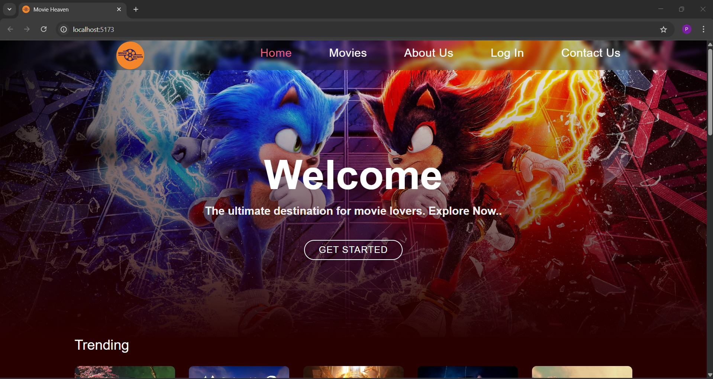

<h3>🔥 Trending Movies</h3>
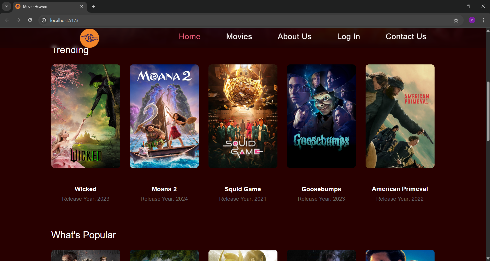

<h3>🎬 Movies Page</h3>
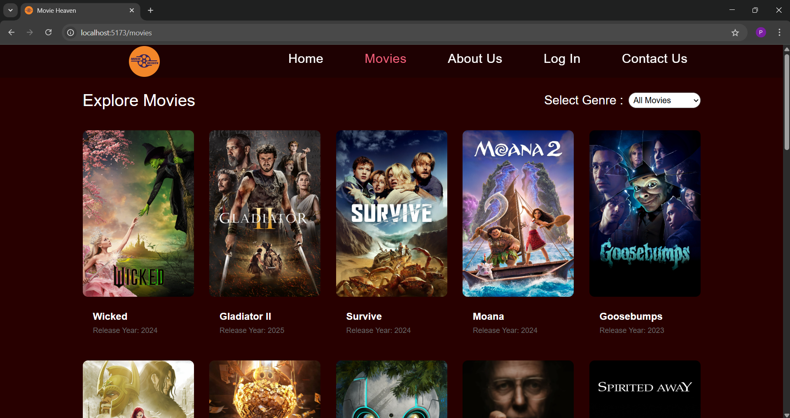

<h3>ℹ️ About Page</h3>
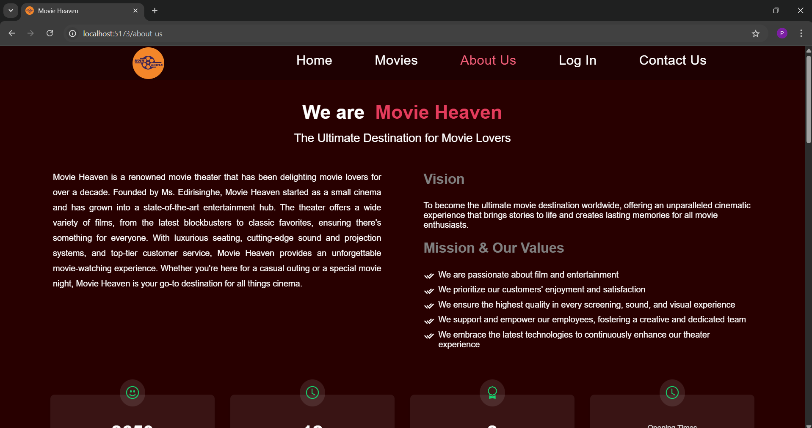

<h3>🧾 Theater Images and Reviews</h3>
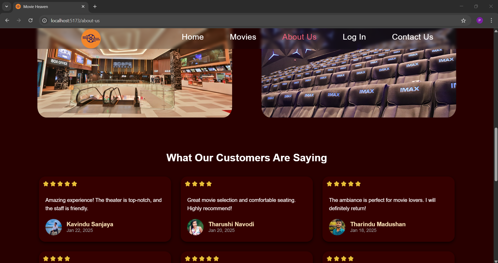

<h3>🔐 Log In</h3>
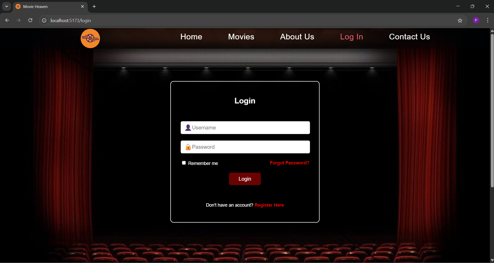

<h3>📝 Sign Up</h3>
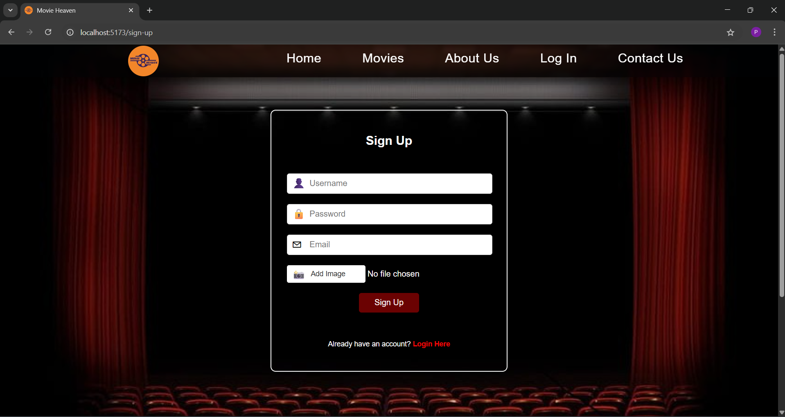

<h3>📞 Contact Us Page</h3>
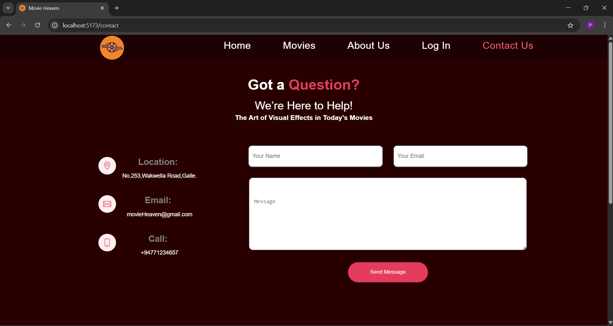

<h3>📍 Location</h3>
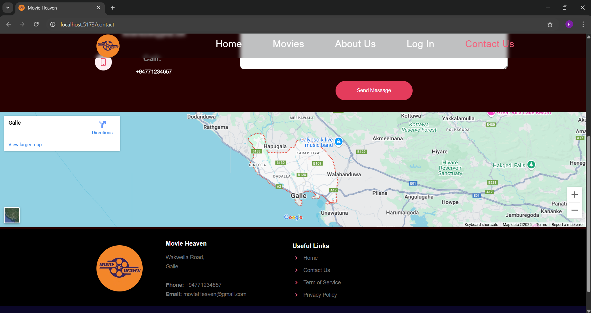

<h3>🎥 Selected Movie Details</h3>
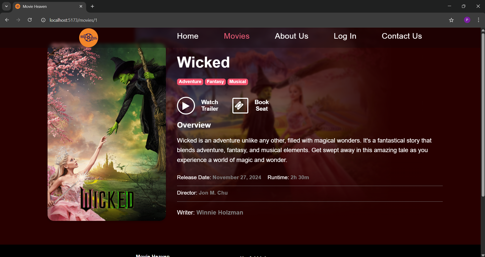


<h3>🎫 Booking Seats</h3>
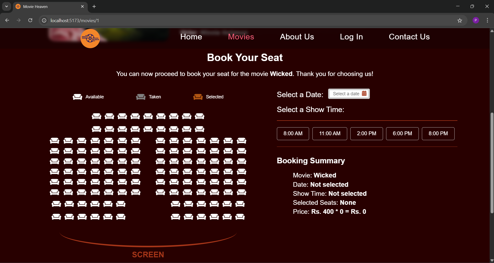


---

## 🙋‍♀️ Author

- Name: [Pavani Edirisinghe] <br>
- University: University of Ruhuna <br>
- GitHub:[pavani-edirisinghe](https://github.com/pavani-edirisinghe)<br>

---

## 📜 License
- This project is licensed under the MIT License.
